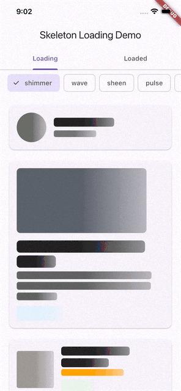

# Skeleton Tint

[](https://pub.dev/packages/skeleton_tint)
[](LICENSE)

Tired of skeleton loaders that flash gray then pop into the real colors?

This package keeps it small: color-matched Flutter skeleton widgets that
match the **color** of the content they replace, not just its shape.

## Features

- `Skeleton` — an ambient scope that marks a subtree as loading.
- `SkeletonText` — wraps a `Text`; bone color follows the text's own
  style color. Pass a `preview` listenable to reflow the bone's width as
  partial text arrives, before the real content is ready.
- `SkeletonImage` — drop-in for `Image`; bone color is sampled from the
  image's average pixel color, and bone size matches the image's own
  decoded dimensions when `width`/`height` aren't given.
- `SkeletonBox` — wraps a `Container`; bone color and size follow the
  container's own `color`/`width`/`height`.
- `SkeletonBone` — the low-level shimmer bone used to build custom
  color-matched placeholders.

`width`/`height` are optional everywhere — omit them and each widget sizes
itself from its content (or the space its parent gives it) instead of a
generic placeholder box.

## Demo

<p align="center">
  
</p>

## Usage

Add the package to `pubspec.yaml`

```bash
flutter pub add skeleton_tint
```

or

```yaml
dependencies:
  skeleton_tint: ^0.1.0 # x-release-please-version
```

Then import the package.

```dart
import 'package:skeleton_tint/skeleton_tint.dart';
```

Wrap a subtree with `Skeleton` and swap in the color-matched widgets:

```dart
Skeleton(
  loading: isLoading,
  child: Column(
    children: [
      SkeletonImage(
        image: NetworkImage(user.avatarUrl),
        borderRadius: BorderRadius.circular(24),
      ),
      SkeletonText(
        child: Text(
          user.name,
          style: const TextStyle(fontSize: 16, color: Colors.black87),
        ),
      ),
      SkeletonBox(
        child: Container(
          color: Colors.blue.shade50,
          width: 120,
          height: 32,
          child: PriceTag(product.price),
        ),
      ),
    ],
  ),
);
```

Toggle `loading` on the ambient `Skeleton` and every descendant
`SkeletonText`/`SkeletonImage`/`SkeletonBox` switches between its bone and
the real widget automatically.

### Widget options

Every property below is optional unless marked required; full docs are on
each constructor and on [pub.dev](https://pub.dev/documentation/skeleton_tint/latest/).

| Widget | Property | Type | Default | Notes |
| :----- | :------- | :--- | :------ | :---- |
| `Skeleton` | `loading` | `bool` | required | Whether descendants render their bone instead of real content. |
| `SkeletonText` | `child` | `Text` | required | The real `Text` widget the bone replaces. |
| | `width` | `double?` | `null` | Max width to wrap lines at. Defaults to the space the parent gives it. |
| | `preview` | `ValueListenable<String?>?` | `null` | Partial text known before `child`'s data is final; the bone reflows live as it updates. |
| | `borderRadius` | `BorderRadius?` | `null` | Defaults to a small radius scaled from font size; pass a large radius for a pill shape (e.g. price-tag-like text). |
| `SkeletonImage` | `image` | `ImageProvider` | required | The real image; sampled once per instance for its average color. |
| | `width` / `height` | `double?` | `null` | Default to the image's own decoded size once known. |
| | `fit` | `BoxFit?` | `null` | Forwarded to the real `Image` once loaded. |
| | `borderRadius` | `BorderRadius` | `BorderRadius.zero` | Applied to both the bone and the real image. |
| `SkeletonBox` | `child` | `Container` | required | The real `Container` the bone replaces. |
| | `color` | `Color?` | `null` | Defaults to `child`'s own `Container.color`. |
| | `width` / `height` | `double?` | `null` | Default to `child`'s own tight size, if any. |
| | `borderRadius` | `BorderRadius` | `BorderRadius.zero` | Bone corner radius. |
| `SkeletonBone` | `color` | `Color` | required | The bone's base shimmer color. |
| | `width` / `height` | `double?` | `null` | Fill the parent's bounded size, or a fixed extent when unbounded. |
| | `borderRadius` | `BorderRadius` | `BorderRadius.circular(4)` | Bone corner radius. |

## Example App

The repo includes a runnable example in [`example/`](example/) with
**Loading**/**Loaded** tabs to compare the bone and real content side by
side.

```bash
cd example
fvm flutter run
```

## Development

This project uses [FVM](https://fvm.app/) to pin the Flutter SDK (see
`.fvmrc`).

```bash
fvm flutter pub get
fvm flutter analyze
fvm flutter test
```

## Contributing

Pull requests are welcome. If you change public behavior or the documented
API, keep the README and example app in sync. See
[CONTRIBUTING.md](CONTRIBUTING.md) for details.

## Issues

Bug reports and feature requests are best opened in the
[GitHub issue tracker](https://github.com/karloows/skeleton/issues).

## License

This project is licensed under the [MIT License](LICENSE).

## Contributors

<a href="https://github.com/karloows/skeleton/graphs/contributors">
  
</a>
